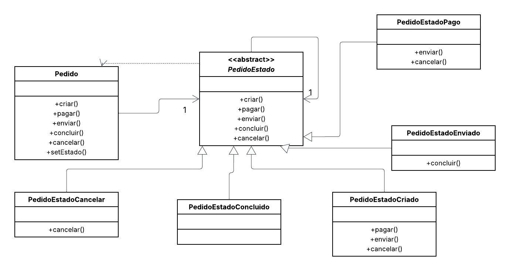

# 🔄 Sistema de Gestão de Pedidos

Este projeto implementa **o padrão de projeto comportamental State (Estado)**.

O objetivo é simular **o gerenciamento do ciclo de vida de um `Pedido`**, encapsulando cada estado (`Criado`, `Pago`, `Enviado`, `Concluido`, `Cancelar`) em seu próprio objeto. Isso permite que o objeto `Pedido` altere seu comportamento quando seu estado interno muda, fazendo parecer que o objeto mudou de classe.

Este design também aplica o **princípio Open/Closed (Aberto para extensão, fechado para modificação)**. A classe de contexto (`Pedido`) permanece fechada para modificações, enquanto novos estados (classes que herdam de `PedidoEstado`) podem ser facilmente adicionados no futuro para estender o comportamento do sistema, sem a necessidade de alterar o código do `Pedido`.

---

## 📌 Diagrama de Classes

---

## 👩‍💻 Autora

**Eduarda Araujo Carvalho**
